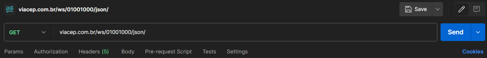
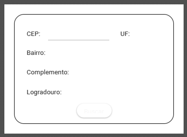
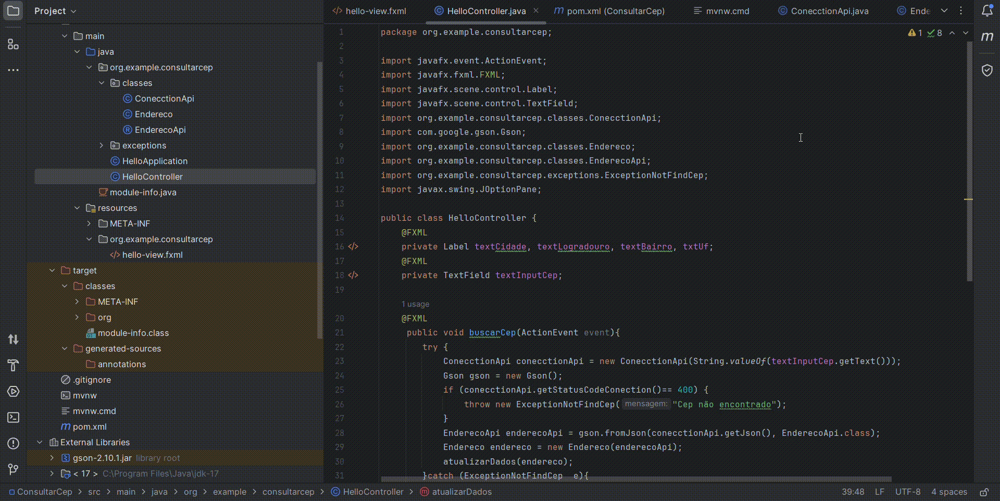

# Consumindo a api ViaCep 
Este projeto consiste em criar uma aplicação em Java que consulte a API <a href="https://viacep.com.br/"> ViaCEP</a>, mostrando para os usuários as informações sobre seu endereço usando JavaFx.
<hr>

### Acessando o webservice de CEP

Para acessar o webservice, um CEP no formato de 8 dígitos deve ser fornecido, por exemplo "11110000".

Após o CEP, deve ser fornecido o tipo de retorno desejado, que deve ser "json" ou "xml", no nosso caso trabalharemos com json.

<strong>Como deve ficar a consulta de CEP:</strong>

```
viacep.com.br/ws/01001000/json/

```

Se testarmos essa requisição no Postman ela retorna-rá esse resultado
 

<strong>Resultado:</strong>

```json
{
    "cep": "01001-000",
    "logradouro": "Praça da Sé",
    "complemento": "lado ímpar",
    "bairro": "Sé",
    "localidade": "São Paulo",
    "uf": "SP",
    "ibge": "3550308",
    "gia": "1004",
    "ddd": "11",
    "siafi": "7107"
}
```
<hr>


### Interface Java UIs

Para a criação da interface foi utilizado o programa SceneBuilder, assim o resultado esperado deve ficar assim:



<hr>

### Como vou converter o Json em um objeto?

Para realizar conversão do arquivo em um objeto precisamos usar uma biblioteca chamada <a href="https://mvnrepository.com/artifact/com.google.code.gson/gson">"Gson"</a>, biblioteca do Google utilizada para a conversão de Json para objetos Java.

### Adicionando a biblioteca Gson no nosso projeto pela IDE do intelliJ


<hr>

### Resultado do projeto


